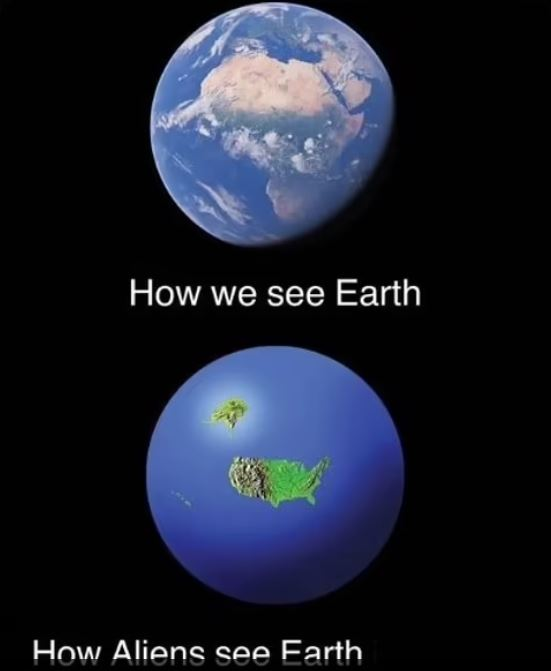
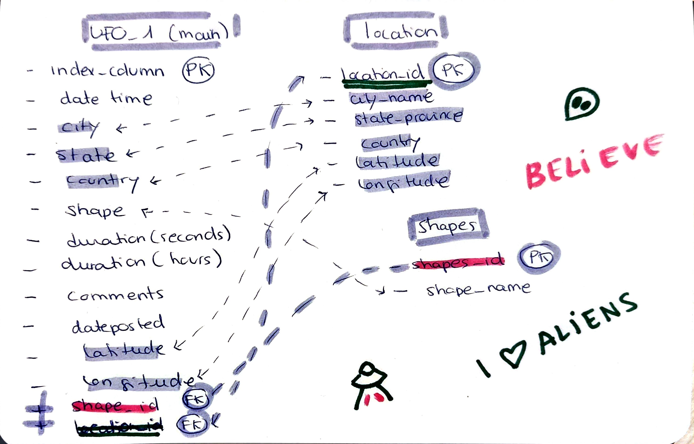
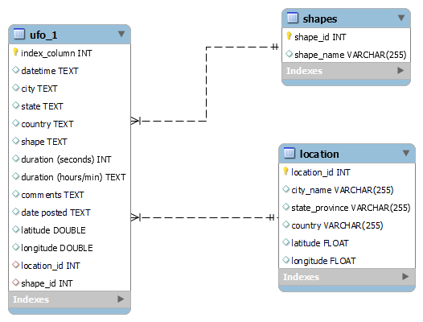
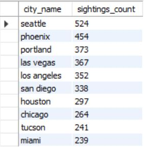
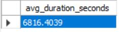
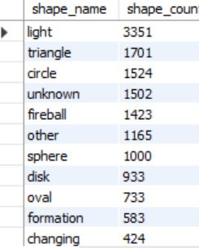

<h2 align="center">🔭 THE UFO SIGHTINGS PROJECT 🛸</h2> 
<div style="text-align:center;">


</div>

<p align="center"><i>Description available in ES and ENG</i>


## Table of contents
- [Introducción:](#introducción)
- [PLANTEAMIENTO HIPÓTESIS](#planteamiento-hipótesis)
  - [HIPÓTESIS 1](#hipótesis-1)
  - [HIPÓTESIS 2](#hipótesis-2)
  - [HIPÓTESIS 3](#hipótesis-3)
- [PROCESO:](#proceso)
  - [PROCESO FRUSTRANTE… Y PRODUCTIVO (APRRENDIENDO MUCHAS COSAS DE MYSQL)](#proceso-frustrante-y-productivo-aprrendiendo-muchas-cosas-de-mysql)
- [RESULTADOS:](#resultados)
  - [HIPOTESIS 1](#hipotesis-1)
  - [HIPOTESIS 2](#hipotesis-2)
  - [HIPOTESIS 3](#hipotesis-3)
- [CONCLUSIONES:](#conclusiones)
- [ENGLISH INFO:](#english-info)

### LINK TO DASHBOARD: https://public.tableau.com/views/UFOSightingProject/STORYUFOS?:language=en-US&:sid=&:display_count=n&:origin=viz_share_link

## Introducción:
**Creéis en los extraterrestres?** Yo si! Pero… nos han visitado realmente o la gente tiene mucha imaginación?

En cualquier caso si “presuntamente” nos han visitado, que quieren? 
**El dataset original de kaggle contenía más de 80.000 registros de avistamientos de ovnis que se remontan a 1949.**
Con los datos de latitud y longitud es posible evaluar la distribución global  o patrones de los avistamientos de ovnis. 
Las fechas y horas, junto con la duración de la estancia del OVNI y la descripción de la nave también se prestan a predicciones. Pero vamos a intentar resolver las preguntas que de verdad nos interesan. Como por ejemplo…

 ¿Los extraterrestres trabajan los fines de semana? Cúando es mas probable ver a ET?

<div style="text-align:center;">
    <div style="display:inline-block;">
        
    </div>
    <div style="display:inline-block;">
        
    </div>
</div>

## PLANTEAMIENTO HIPÓTESIS
(Posteriormente presento resultados con apoyo de Dashbord de Tableau)

### HIPÓTESIS 1
¿Les gustan al los aliens las hamburguesas? ¿Tienen afan de protagonismo hollywoodiense? Sólo están interesados en visitar EEUU?

### HIPÓTESIS 2 
La duración de los avistamientos es corta, pues hay datos registrados en medida de segundos y al tratarse de avistamientos la tendencia es a pensar que son visitas cortas.

### HIPÓTESIS 3 
Como hemos visto en las peliculas, la mayoria de avistamientos son con naves en forma de disco o platillo. Sera así?

<div style="text-align:center;">
    <div style="display:inline-block;">
        
    </div>
    <div style="display:inline-block;">
        
    </div>
</div>

## PROCESO:
### PROCESO FRUSTRANTE… Y PRODUCTIVO (APRRENDIENDO MUCHAS COSAS DE MYSQL)

<div style="text-align:center;">
    <div style="display:inline-block;">
        
    </div>

<p align="center"><i>Mi visión:de los tiburones pasamos a los aliens…</i>

<div style="text-align: left;">

Tras limpiar brevemente los datos con Python me quedé con un dataset de casi 70.000 (originalmente de 80.000) observaciones. Lo importé a MySQL y me di cuenta que lo dejé mal indexado así que aprendí a crear nuevos index con MySQL.


```sql 
CREATE UNIQUE INDEX index_name ON table_name (column_name);
```
A la hora de realizar las tablas me encontré con muchos, muchos problemas... 

**Pero son realmente problemas si tienen solución?**

Me llevé una buena frustración però aprendí muchas cosas, entre otras la gran importancia de crear tablas de backup! (Porqué ya destrocé una anteriormente y me tocó importar todos los datos de nuevo!)

El impedimento no erradicaba el hecho de crear las tablas (en base a la tabla principal dónde tenía toda la información) sinó tras crear las respectivas **Primary Keys y Foreign Keys.**

Pues quería incluir en la tabla base (madre), las columnas de Foreign Key creades en las subtablas, o tablas (hijas)  para establecer las relaciones y para desupés borrar de la tabla principal las columnas ya presentes en otras tablas (para tener todo mas limpio y no tener info repetida y así poder crear queries con joins). (Menudo lio no?)
</div>

<div style="text-align:center;">
    <div style="display:inline-block;">
        
    </div>
<p align="center"><i>Mi schema</i>

<div style="text-align: left;">
A la hora de imputar de información las columnas creadas en la tabla base/madre en relación a las tablas hijas, mi workbench no me respondía a ninguna query, no ejecutava nada y me salían todo tipo de errores especialmengte el famoso **“pérdida de conexión con el sevidor”** al ser queries con muchos joins o muy exigentes tal vez que alargaban el tiempo de procesado…

Me pasé horas en StackOverflow viendo miles de soluciones, pero no me salía nada…

Os preguntaréis que cosas que intenté ejecutar y mi workbench no podía?

```sql
UPDATE ufo_1
JOIN location ON ufo_1.city = location.city_name 
AND ufo_1.state = location.state_province 
AND ufo_1.country = location.country
AND ufo_1.latitude = location.latitude
AND ufo_1.longitude = location.longitude
SET ufo_1.location_id = location.location_id;
```
o por ejemplo...
```sql
UPDATE ufo_1
SET location_id = (
    SELECT location_id
    FROM location
    WHERE ufo_1.city = Location.city_name
    AND ufo_1.state = Location.state_province
    AND ufo_1.country = Location.country
    LIMIT 1
);
```
entre otras muchas cosas.

Finalmente aprendí algo muy útil que es el **batch processing!** Procesar en batch o lotes (de las filas que quieras o tu cpu pueda tolerar) para así no saturar la pobre máquina.

Aprendí a crear **Procedures** en SQL (parecido a una función, para el batch processing de cada caso) y me pareció muy interesante la estructura
```sql
CREATE PROCEDURE UpdateUFOWithLocation()
BEGIN
    -- Declaración variables
    DECLARE total_rows INT;
    DECLARE offset INT;
    DECLARE batch_size INT;
    
    -- Numero total de filas a actualizar (68119)
    SELECT COUNT(*) INTO total_rows FROM ufo_1;
    
    -- Tamaño del batch (mil filas cada vez)
    SET batch_size = 1000; -- Adjust the batch size as needed
    
    -- Inicializar offset
    SET offset = 0;
    
    -- Loop hasta que todas las filas esten actualizadas
    WHILE offset < total_rows DO
        -- Update a batch of rows
        UPDATE ufo_1
        JOIN (
            SELECT u.index_column, l.location_id
            FROM ufo_1 u
            JOIN Location l ON u.city = l.city_name 
                           AND u.state = l.state_province 
                           AND u.country = l.country
                           AND u.latitude = l.latitude
                           AND u.longitude = l.longitude
            LIMIT offset, batch_size
        ) AS batch_location ON ufo_1.index_column = batch_location.index_column
        SET ufo_1.location_id = batch_location.location_id;
        
        -- incrementar offset del proximo batch
        SET offset = offset + batch_size;
    END WHILE;
END //
```

(Create procedure, begin, declare….call)

Finalmente lo coneguí y ya pude dormir tranquila…**por un rato.**

Luego afortunadamente ya pude continuar con el proceso del project con los requirements y con Tableau.


## RESULTADOS:

<div style="text-align:center;">
    <div style="display:inline-block;">
        
    </div>
</div>

### HIPOTESIS 1

Como he visto en SQL y Tableau sin duda y de forma aplastante hay mas registros de EEUU 
Siendo estos los estados con mas datos:




### HIPOTESIS 2

Muchas de las visitas duran mas de 4000 segundos que equivalen a 1h lo cual desmiente la hipotesis inicial, en las graficas del dashboard de Tableau se ve un registro con unos 97878 segundos que son unas 27 horas en total.

La media realizada con my SQL informa que la media de los avistamientos es de: 6816 seconds que són casi 2h.




### HIPOTESIS 3

Como se ha visto en las visualizaciones de Tableau (Dashboard, SHAPES graph) las formas de OVNI mas reportadas han sido

- Light 

- Triangle 

- Circulo 

- Mención Honorífica al ovni con forma de Fireball.
  



## CONCLUSIONES:

A pesar que los datos originales sean limitados (hay muchas observaciones de USA y muy pocas del resto del mundo) ha sido una buena práctica para generar bases de datos y tablas en MySQL y alguna visualización en Tableau, he aprendido muchas más cosas en ese sentido que sobre los OVNIS pero me ha parecido una tematica interesante para aprender a trabajar con datos y que sea agradable. Algunas de las conclusiones me han sorprendido y en general me ha parecido una buena manera de poner en practica lo aprendido.

</div>


<div style="text-align:center;">
    <div style="display:inline-block;">
        
    </div>
</div>

---
## ENGLISH INFO:
## Introduction:
**Do you believe in aliens?** I do! But... have they really visited us or do people have a lot of imagination?

In any case, if they have “allegedly” visited us, what do they want?
**The original kaggle dataset contained over 80,000 records of UFO sightings dating back to 1949.**
With latitude and longitude data it is possible to evaluate the global distribution or patterns of UFO sightings.
The dates and times, along with the length of the UFO's stay and the description of the craft also lend themselves to predictions. But we are going to try to solve the questions that really interest us. For example…

Do aliens work on weekends? When are you most likely to see ET?

## HYPOTHESIS APPROACH
(Later I present results with the support of Tableau Dashbord)

### HYPOTHESIS 1
Do aliens like hamburgers? Do they have a desire for Hollywood prominence? Are you only interested in visiting the USA?

### HYPOTHESIS 2
The duration of the sightings is short, since there is data recorded in seconds and since they are sightings, the tendency is to think that they are short visits.

### HYPOTHESIS 3
As we have seen in the movies, most sightings are with disk or saucer-shaped ships. Will it be like this?

---

## PROCESS

After briefly cleaning the data with Python I was left with a dataset of almost 70,000 (originally 80,000) observations. I imported it into MySQL and I realized that I left it indexed incorrectly so I learned to create new indexes with MySQL.
When making the tables I encountered many, many problems...
**But are they really problems if they have a solution?**

I had a lot of frustration but I learned many things, among others the great importance of creating backup tables! (Because I already destroyed one before and had to import all the data again!)

The impediment did not eradicate the fact of creating the tables (based on the main table where it had all the information) but after creating the respective **Primary Keys and Foreign Keys.**

Well, I wanted to include in the base table (parent), the Foreign Key columns created in the subtables, or tables (child) to establish the relationships and then delete from the main table the columns already present in other tables (to have everything more clean and not have repeated information and thus be able to create queries with joins). (What a mess, right?)

---

When it came to imputing information from the columns created in the main/parent table in relation to the child tables, my workbench did not respond to any query, it did not execute anything and I got all kinds of errors, especially the famous **“loss of connection with the server”** being queries with many joins or very demanding perhaps that lengthened the processing time…

I spent hours on StackOverflow looking at thousands of solutions, but nothing came up...

Finally I learned something very useful which is **batch processing!** Process in batches (of the rows you want or your CPU can tolerate) so as not to saturate the poor machine.

I learned to create **Procedures** in SQL (similar to a function, for the batch processing of each case) and I found the structure very interesting

---

## RESULTS:

### HYPOTHESIS 1

As I have seen in SQL and Tableau, there are undoubtedly and overwhelmingly more records from the US
These being the states with the most data:


### HYPOTHESIS 2

Many of the visits last more than 4000 seconds, which is equivalent to 1 hour, which refutes the initial hypothesis. In the Tableau dashboard graphs, you can see a record with about 97,878 seconds, which is about 27 hours in total.

The average made with my SQL reports that the average of the sightings is: 6816 seconds, which is almost 2 hours.


### HYPOTHESIS 3

As seen in the Tableau visualizations (Dashboard, SHAPES graph) the most reported UFO shapes have been

- Light

- Triangle

- Circle

- Honorable mention to the Fireball-shaped UFO.


-- 
## CONCLUSION:

Although the original data is limited (there are many observations from the USA and very few from the rest of the world) it has been a good practice to generate databases and tables in MySQL and some visualization in Tableau, I have learned many more things in that sense than about UFOs, but I found it to be an interesting topic to learn how to work with data and make it enjoyable. Some of the conclusions have surprised me and in general I have found it a good way to put into practice what I have learned.

---
